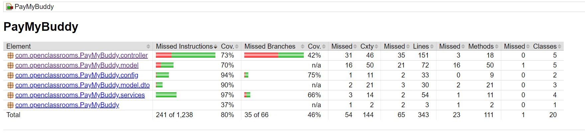

# PayMyBuddy

**_Projet 6 OpenClassrooms :_**

JAVA 18 MAVEN 3.9.4

MYSQL 8.0.31

SPRING BOOT 3.1.3

SPRING SECURITY 6.1.3

SPRING CORE 6.0.11

THYMELEAFE 3.1.2

**_installation :_**

- installez le jdk et maven, installez MySQL. 

- téléchargez le projet sur  https://github.com/Mourad-x64/PayMyBuddy

- dans le répertoire du projet, lancez la commande "mvn clean install".

- ajoutez les accès MySQL en variable d'environnement.

- lancez MySQL.

- lancez le projet : serveur sur le port 8080.

**_Livrables :_**

**_MPD :_**

**_UML :_**

Login :

**_Couverture de tests :_**

